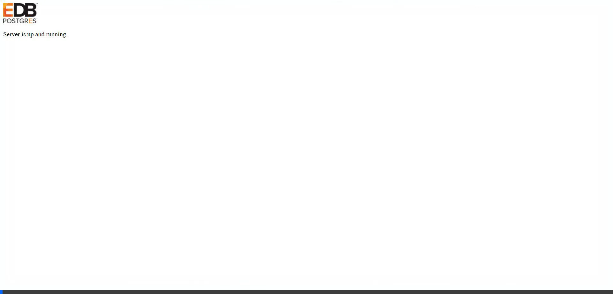

# Rolling Dice Simulator 🎲

A sleek, interactive, and modern 3D Rolling Dice application built using **HTML5**, **CSS3**, and **Vanilla JavaScript**.

## Features

- **3D Tumbling Dice Animation**: Realistic CSS 3D cube rotations (`preserve-3d`) that spin on click/keypress and land on the rolled face.
- **1 Die & 2 Dice Modes**: Switch between rolling a single die or two dice simultaneously.
- **Procedural Web Audio Engine**: Synthesized dice clattering sounds using the Web Audio API without any external sound files.
- **Roll History & Breakdown**: Real-time roll log tracking totals and individual die values.
- **Keyboard Shortcuts**: Press <kbd>Spacebar</kbd> or <kbd>Enter</kbd> to roll instantly.
- **Responsive & Modern Design**: Dark glassmorphism theme with vibrant glowing elements.

## Tech Stack

- **HTML5**: Semantic layout & accessibility.
- **CSS3**: 3D keyframe animations, CSS Grid/Flexbox, glassmorphism, HSL color variables.
- **JavaScript (ES6+)**: Event handling, DOM manipulation, 3D matrix math, Web Audio API sound synthesis.

## Quick Start & Live Demo

1. **Live Preview**: Enable **GitHub Pages** in Repository Settings -> Pages -> Source: `main` branch `/ (root)`.
2. **Local**: Clone the repo and open `index.html` in any web browser.

## License

MIT License
