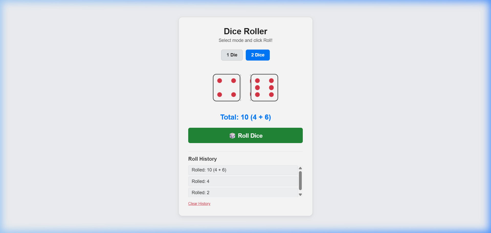

# Dice Rolling Game 🎲

A simple, beginner-friendly Dice Rolling application built using **HTML**, **CSS**, and **JavaScript**.

## Features

- **Dice Rolling Animation**: Smooth 3D dice spin animation when you click the Roll button.
- **1 Die & 2 Dice Modes**: Switch easily between rolling 1 die or 2 dice.
- **Roll History**: Keeps track of all past rolls and sums.
- **Clean & Simple Code**: Easy to understand, study, or modify for beginners.

## How to Run

1. Open `index.html` in any web browser.
2. Click **🎲 Roll Dice** to roll!

## Tech Stack

- **HTML5**
- **CSS3**
- **Vanilla JavaScript**
